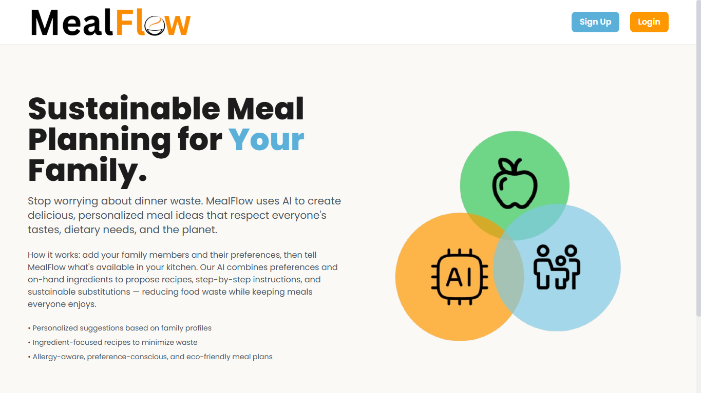

# MealFlow

AI-powered recipe generation for Indian households

## Overview

MealFlow was created to simplify decision making at meal times in Indian households. By understanding every family member's preferences and requirements, MealFlow combines this knowledge with available ingredients to generate a detailed recipe that fits everyone's needs.

## Features

- Storage of family member preferences 
- Comprehensive list of Indian ingredients (stored in `[ingredients.csv](https://github.com/rishitc17/MealFlow/blob/main/frontend/ingredients.csv)`)
- AI-powered recipe generation

## Technologies

- HTML
- CSS
- JavaScript
- Python
- Appwrite
- Groq

## Screenshots

## Future Improvements

- Add a feature to save meals or recommend more meals of a similar style
- Expand beyond meal-time to include daily or weekly planning

## Status

Ready for deployment
